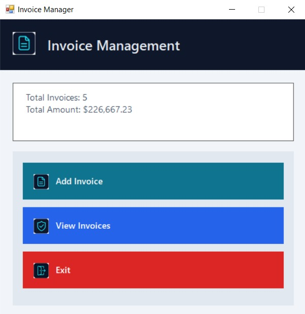
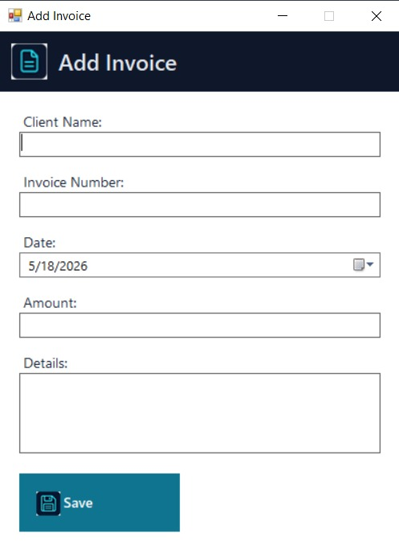
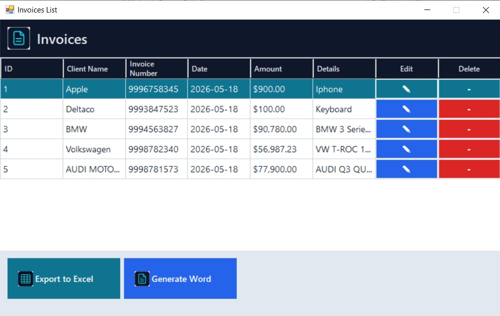
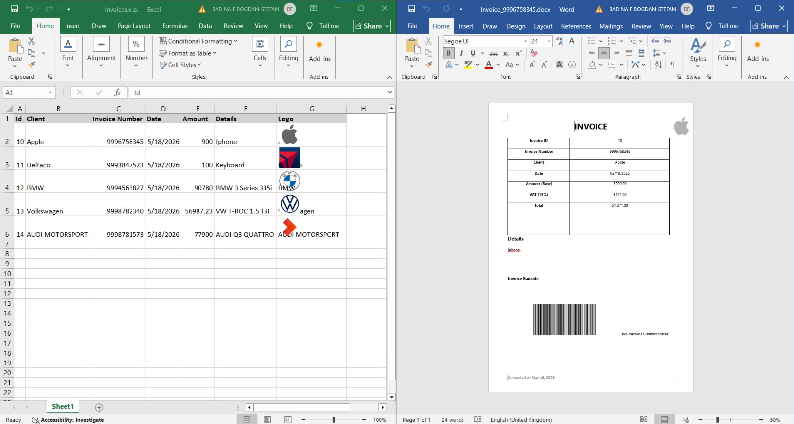

# Invoice Manager

A Windows Forms desktop application for creating, editing, listing, exporting, and printing invoices.

Developed by **Bogdan2K2**.

## Features

- Add invoices with client, number, date, amount, and details
- View invoices in a styled grid
- Edit and delete invoices directly from the list
- Auto-maintained continuous invoice IDs for display/export
- Export all invoices to Excel (`.xlsx`)
- Generate detailed invoice documents in Word (`.docx`)
- Client logo lookup and barcode generation for invoices

## Tech Stack

- C# (.NET Framework 4.7.2)
- Windows Forms
- SQLite (`System.Data.SQLite`)
- EPPlus (Excel generation)
- Microsoft Office Interop (Word/Excel automation)
- ZXing.Net (barcode generation)

## Project Structure

- `InvoicesManager/` - Main desktop application
- `ExcelAddInInvoicesChart/` - Related Excel add-in project

## Build & Run

### Prerequisites

- Windows 10/11
- Visual Studio 2022 (or compatible MSBuild tooling)
- .NET Framework 4.7.2 Developer Pack
- Microsoft Office (required for Word/Excel export features)

### Steps

1. Open `InvoicesManager/InvoicesManager.sln` in Visual Studio.
2. Restore NuGet packages.
3. Set `InvoicesManager` as startup project.
4. Build and run.

## Notes

- Word and Excel export features rely on Microsoft Office Interop, so Office must be installed on the machine running the app.
- If you need a server-side or headless export flow, prefer EPPlus/OpenXML-based export instead of Office automation.

## Screenshots

### 1. Main Dashboard

The home screen provides a quick business summary (`Total Invoices` and `Total Amount`) and clear entry points for the core workflow: adding invoices, viewing invoices, and exiting the app.

### 2. Add Invoice Form

This form captures invoice data with validation for required fields (client, invoice number, amount) and a date picker for consistent date entry.

### 3. Invoices List With Actions

The invoices grid shows all records with action columns for `Edit` and `Delete`, plus export buttons for Excel and Word at the bottom.

### 4. Export Preview (Excel + Word)

The app exports invoice rows (with logos) to Excel and creates a branded Word invoice that includes calculated totals and a generated barcode.

## License

This project is distributed under the End User License Agreement in [EULA.md](./EULA.md).
